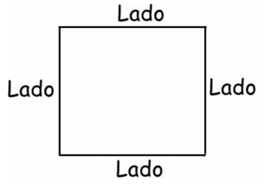

# Lista de Exercícios 01

Esta lista apresenta exercícios para o treinamento dos conceitos de variáveis, palavras reservadas, tipos de variáveis, operadores aritméticos, atribuição de valores e entrada e saída de dados.

<html>
<h2>Enunciados</h2>

01 – Elaborar um algoritmo que imprima a frase abaixo: “Aprendendo Algoritmo”

02 – Elabore um algoritmo que imprima a frase da maneira descrita abaixo, uma frase abaixo da outra: 
Aprendendo Algoritmo 
e Fazendo muito Exercício 
Primeiro fazendo exercício em ‘C#’

03 – Crie um algoritmo que leia dois nomes e imprima os nomes na sequência em que
 foram escritos e posteriormente os imprima na ordem inversa.

04 – Crie um algoritmo que receba duas variáveis do tipo inteiro. Atribuir um valor para cada variável e posteriormente exibir este valor. Para finalizar, exibir a primeira variável acrescida de uma unidade e exibir a segunda
 variável decrescida de uma unidade.

05 – Cria um algoritmo que receba 5 números do tipo double e exiba a soma com a
 seguinte frase: 

“Os números digitados foram ..., ..., ..., ... e sua soma é ... .

06 – Ler dois números e exibir as seguintes mensagens: 
O números digitados foram ... e .... . 
A soma dos números ... e ... é ... . 
A subtração dos números ... e ... é ... . 
A multiplicação dos números ... e ... é ... . 
A divisão dos números ... e ... é ... . 
A média dos números ... e ... é ... .

07 – Ler um número inteiro e imprimir seu antecessor e seu sucessor. 
SAÍDA: 
O número digitado foi ..., seu antecessor é ... e seu sucessor é ...

08 – Elabore um algoritmo que calcule a área e o perímetro de um quadrado. 
Área = lado2 
Perímetro = é a soma de todos os lados

09 – Elabore um algoritmo que calcule a área e o perímetro de um retângulo. 
Área = b x h 
Perímetro = é a soma de todos os lados

</html>
